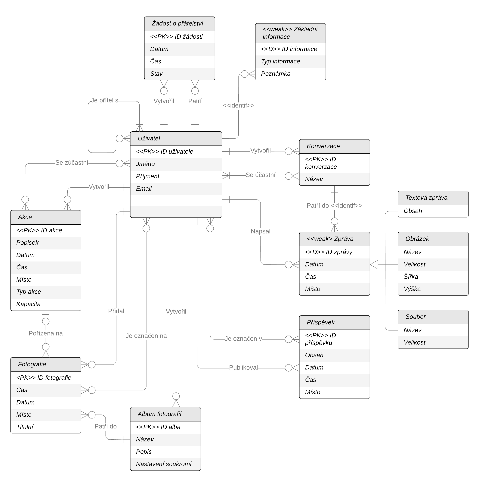
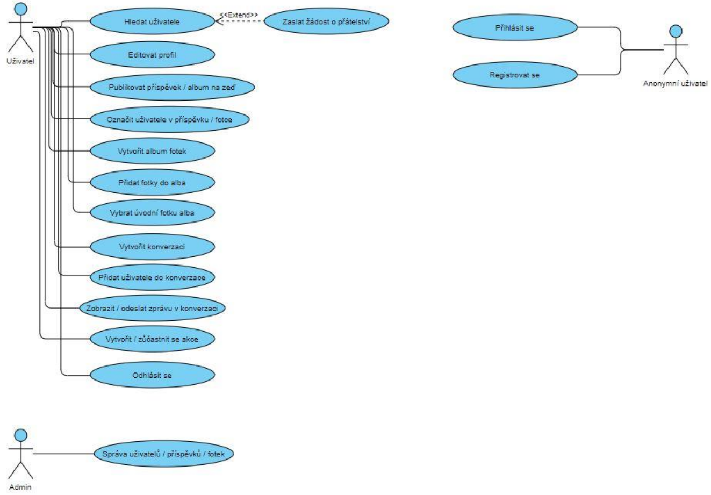

# Database project of social network

# 1 Zadání

Na sociální síti bude možné uchovat všechny základní informace o uživatelích (včetně škol, bydliště, zaměstnání, kontaktu, vztahů...). Uživatelé si mezi sebou mohou vytvářet (imaginární) přátelství pomocí žádosti. Každý uživatel má svoji zeď, kde může on i jeho přátelé publikovat příspěvky, které budou mít obsah, datum, místo a čas publikování a mohou v nich být označeni i jiní uživatelé. Uživatelé mohou sdílet nejen své příspěvky, ale také fotky, mohou vytvářet i alba fotek, které budou mít svůj název, nastavení soukromí a popis. Na jednotlivých fotkách mohou být označeni různí uživatelé a bude u nich uveden čas, datum a místo pořízení a jedna z fotek bude vždy titulní fotka alba. Navíc může být fotka pořízena v rámci nějaké akce. Uživatelé si mohou prostřednictvím konverzace s jistým názvem vyměňovat zprávy, které budou mít svůj obsah, datum, čas a místo zaslání. Uživatelé mohou vytvářet akce, které se konají na určitém místě, v určitý čas a den a mohou mít nastavenou kapacitu (pokud není nastavena, kapacita je neomezená). Účastníci akce by měli znát o jakou akci se jedná a pokud se jim akce zalíbí, tak se mohou akce, ať už jen virtuálně, či skutečně zúčastnit.

## 2 Databázový model a model případů užití




## 3 Vytvoření základních objektů schématu databáze

## 4 SQL dotazy SELECT

### 4.1 Spojení dvou tabulek

```sql
-- Jaké příspěvky publikoval uživatel
SELECT jmeno, prijmeni, obsah
FROM uzivatel U, prispevek P
WHERE U.id = P.autor;

-- Další dotaz
SELECT U.jmeno, U.prijmeni, I.vzdelani
FROM uzivatel U, zakladni_informace I
WHERE U.id = I.uzivatel
AND I.vzdelani IS NOT NULL;
```

## 4. SQL dotazy SELECT

### 4.1 Spojení dvou tabulek

```sql
-- Jaké příspěvky publikoval uživatel
SELECT jmeno, prijmeni, obsah
FROM uzivatel U, prispevek P
WHERE U.id = P.autor;
```

### 4.2 Spojení tří tabulek

```sql
-- Kterí uživatelé se zúčastnili akce 'Koncert skupiny XYZ'
SELECT CONCAT(CONCAT(U.jmeno, ' '), U.prijmeni) AS jmeno
FROM uzivatel U, akce A, ucastnici_akce UA
WHERE U.id = UA.uzivatel
AND UA.akce = A.id
AND A.popisek LIKE 'Koncert skupiny XYZ';


-- Na jakých fotkách jsou uživatelé označeni
SELECT CONCAT(CONCAT(U.jmeno, ' '), U.prijmeni) AS jmeno, F.cesta_foto
FROM uzivatel U, foto_oznaceni FO, fotografie F
WHERE U.id = FO.uzivatel
AND FO.fotografie = F.id
ORDER BY jmeno;
```

### 4.3 Dotazy s GROUP BY

```sql
Copy code
-- Kolik fotek patří do daného alba
SELECT A.nazev, COUNT(*) AS pocet_fotek_v_albumu
FROM album A, fotografie F
WHERE A.id = F.album
GROUP BY A.nazev;

-- Kolik fotek bylo pořízeno na akci
SELECT A.popisek, COUNT(*) AS pocet_fotek
FROM akce A, fotografie F
WHERE A.id = F.akce
GROUP BY A.popisek;
```

### 4.4 Dotaz s predikátem EXISTS

```sql
-- Kterí uživatelé mají na profilu informaci o vzdělání a nemají informaci o povolání
SELECT DISTINCT jmeno, prijmeni
FROM uzivatel U, zakladni_informace I
WHERE U.id = I.uzivatel
AND vzdelani IS NOT NULL
AND EXISTS (SELECT *
            FROM zakladni_informace I
            WHERE U.id = I.uzivatel
            AND povolani IS NULL);
```

### 4.5 Dotaz s predikátem IN

```sql
-- Kterí uživatelé založili alespoň jednu konverzaci
SELECT U.jmeno, U.prijmeni
FROM uzivatel U
WHERE U.id IN (SELECT zakladatel FROM konverzace);
```

## 5. Pokročilé objekty schématu databáze

### 5.1 Triggery

Trigger trigger_valid_conversation má za úkol hlásit, aby do dané konverzace mohl přidávat zprávy pouze uživatel, který je členem konverzace (v tabulce uzivatel v konverzaci).
Trigger trigger_capacity_check zabrání, aby se po naplnění kapacity akce nemohl už nikdo další na akci přihlásit

```sql
-- Trigger Definition
CREATE TRIGGER trigger_valid_conversation
BEFORE INSERT ON zprava
FOR EACH ROW
BEGIN
    DECLARE conversation_member INT;
    SELECT COUNT(*) INTO conversation_member
    FROM uzivatel_v_konverzaci
    WHERE uzivatel_id = NEW.uzivatel_id
    AND konverzace_id = NEW.konverzace_id;

    IF conversation_member = 0 THEN
        SIGNAL SQLSTATE '45000'
        SET MESSAGE_TEXT = 'You are not a member of this conversation.';
    END IF;
END;
```

```sql
-- Trigger Definition
CREATE TRIGGER trigger_capacity_check
BEFORE INSERT ON ucastnici_akce
FOR EACH ROW
BEGIN
    DECLARE current_capacity INT;
    DECLARE max_capacity INT;
    SELECT COUNT(*) INTO current_capacity
    FROM ucastnici_akce
    WHERE akce_id = NEW.akce_id;

    SELECT kapacita INTO max_capacity
    FROM akce
    WHERE id = NEW.akce_id;

    IF current_capacity >= max_capacity THEN
        SIGNAL SQLSTATE '45000'
        SET MESSAGE_TEXT = 'Event capacity has been reached.';
    END IF;
END;
```

These triggers ensure that only members of a conversation can add messages to it and prevent further registrations when the event's capacity has been reached.

## 6. Advanced Database Operations

### 6.1 Subqueries

```sql
-- Get all users who have posted at least one comment
SELECT jmeno, prijmeni
FROM uzivatel
WHERE id IN (SELECT autor FROM prispevek);

-- Get the number of comments for each user
SELECT jmeno, prijmeni, (SELECT COUNT(*) FROM prispevek WHERE autor = U.id) AS pocet_prispevku
FROM uzivatel U;
```

### 6.2 Joins

```sql
-- Get the posts and their authors' names
SELECT P.obsah, CONCAT(CONCAT(U.jmeno, ' '), U.prijmeni) AS autor
FROM prispevek P
INNER JOIN uzivatel U ON P.autor = U.id;

-- Get the events and the total number of participants
SELECT A.popisek, COUNT(UA.uzivatel) AS pocet_uctu
FROM akce A
LEFT JOIN ucastnici_akce UA ON A.id = UA.akce
GROUP BY A.popisek;

```

### Views

```sql
-- Create a view for getting the user's full name
CREATE VIEW view_uzivatel_fullname AS
SELECT id, CONCAT(CONCAT(jmeno, ' '), prijmeni) AS cele_jmeno
FROM uzivatel;

-- Query the view
SELECT cele_jmeno
FROM view_uzivatel_fullname
WHERE id = 1;

-- Create a view for getting the average rating of each product
CREATE VIEW view_product_average_rating AS
SELECT produkt_id, AVG(hodnoceni) AS prumerna_hodnota
FROM hodnoceni
GROUP BY produkt_id;

-- Query the view
SELECT P.nazev, V.prumerna_hodnota
FROM produkt P
LEFT JOIN view_product_average_rating V ON P.id = V.produkt_id;

```
